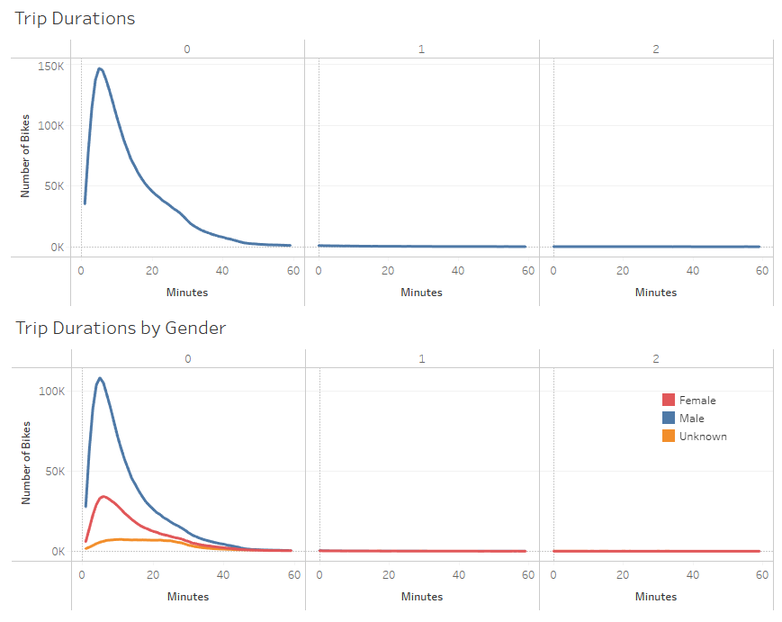
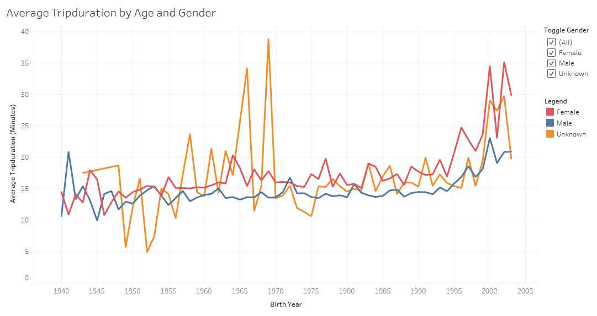
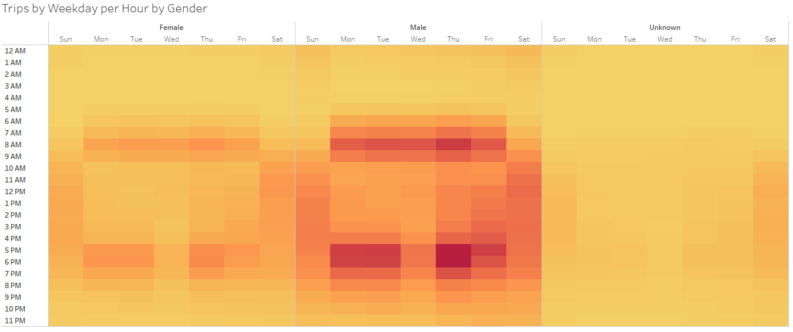
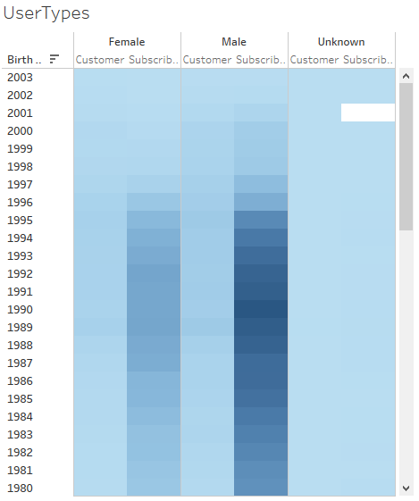
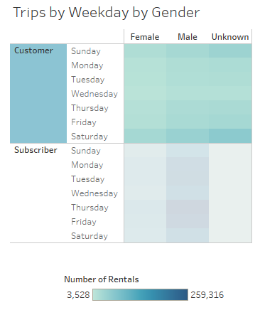
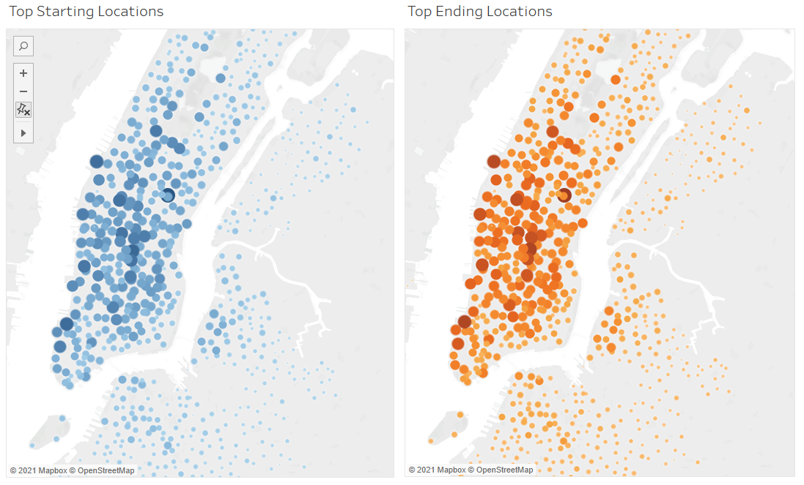

# bikesharing

# Overview
The purpose of this analysis is to examine customer rental patterns from NYC Citibike in order to help our client gather information in order to start up a similar bicycle rental business in Des Moines, Iowa.

# Results
[[Link to analysis on Tableau]](https://public.tableau.com/views/NYC_Citibike_Analysis_16277670977960/NYCCitibikeAnalysis?:language=en-US&publish=yes&:display_count=n&:origin=viz_share_link)

### Trip Durations
The charts below show the amount of time for which each rider checked out their bike. Regardless of gender, a majority of riders rented their bikes for no more than half an hour. It should be noted, however, that there are still a significant number of riders who checked out their bikes for many hours longer.

On average, it appears that female customers tend to rent out bikes for a a few minutes longer than male customers. Younger customers are more likely to rent out their bikes for longer.

(Note that the data point at 1969 for customers of unknown gender is inflated. Customers with unknown demographic data are automatically assigned 01/01/1960 birthdays.)

### Times of the Week Customers are Active
This chart shows a heatmap of the most common times throughout the week that riders checkout bikes from NYC Citibikes. It is clear that during the weekdays bike checkouts tend to correspond to rush hour times, while during the weekends, checkouts tend to occur more evenly throughout the day. There also does not appear to be strong disparities between different genders for when bike rentals most commonly occur.

### Types of Customers
These charts break down the NYC Citibike users by age, gender, and whether or not they are a subscriber to NYC Citibike's services. A majority of users are males in their 20s, and subcribers use the services far more heavily than non-subscribers.

 

### Map of Start and End Locations
Below are the NYC Citibike stations where bikes can be rented and returned. Larger, darker colored markers indicate stations that handled more rentals and returns. Smaller, lighter colored markers indicate stations where fewer rentals and returns were made. The most used stations are clearly centered within Manhattan.

# Summary
Overall, it appears that a majority of bicycle checkouts are made customers who are in their 20s and 30s, and are predominantly male. It will be important to consider the demographic makeup of Des Moines, Iowa when establishing and promoting a bikeshare business, to ensure that there will be a significant enough customer base that will regularly use the service.

A subscription model of payment also appears to be beneficial in maintaining a steady customer base.

Most of the customer traffic in NYC is concentrated in Manhattan, so it will be useful to set up more rental stations within downtown Des Moines or other regions where there typically is a greater amount of commerce and traffic. Several rental stations should also be established in neighboring regions around the city for customers who wish to use the service to travel in or out of the city.

### Suggestions for Future Analyses
It would be worth examining how frequently subscribers use the Citibike service throughout the week versus non-subscribers. There may be a cut off point for frequency of use where non-subscribers may turn into subscribers.

It would also be worth mapping out the home addresses or neighborhoods of subscribing customers to see if there are particular geographical factors that might influence which customers choose to subscribe to the bikeshare service.
